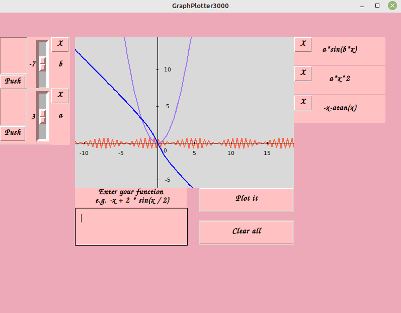
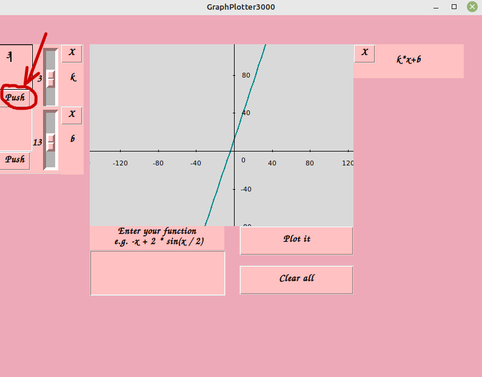
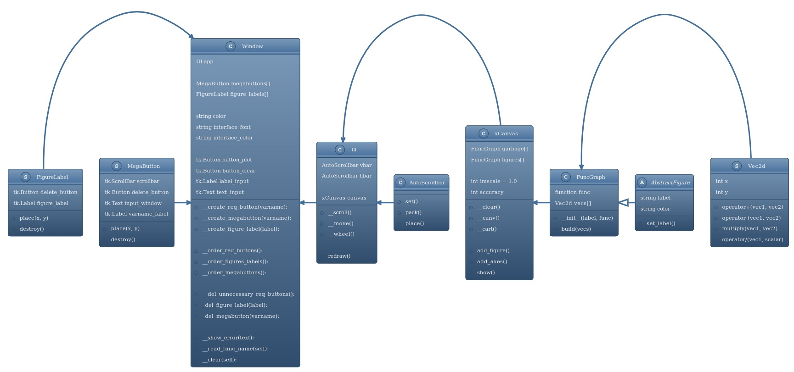

# Minimalistic application for drawing graphs.

# Install:
Linux:
```bash
apt-get install python3-tk
cd  <folder_where_to_clone>
git clone git@gitlab.akhcheck.ru:andrei.sadchikov/graphplotter.git .
```

Windows:
```bash
cd <folder_where_to_clone>
git clone git@gitlab.akhcheck.ru:andrei.sadchikov/graphplotter.git .
```

Docker (linux only):
```bash
docker pull ganjubas2008/graphplotter:graphplotter
docker run -u=$(id -u $USER):$(id -g $USER) -e DISPLAY=$DISPLAY -v /tmp/.X11-unix:/tmp/.X11-unix:rw --rm ganjubas2008/graphplotter:graphplotter
```

# Run:
```bash
cd <folder_where_to_clone>/graphplotter
chmod +x run.sh
./run.sh
```

# Test:
```bash
pip install pytest
apt-get install python3-pytest
cd <folder_where_to_clone>/graphplotter
chmod +x run_test.sh
./run_test.sh
```

# Interaction:

Enter your function in the big box. Build it by clicking on the "Plot it" button and delete it by clicking cross button near function name on the right.

Also you can read parameter from the keyboard. You need to enter it into small box on the left and then click "Push" button (like on the image below).





# Project structure



The <code>canvas.py</code> file contains the <code>xCanvas</code> class responsible for managing <code>FuncGraph</code> objects.

The <code>user_interface.py</code> file contains the <code> UI</code> and <code>Window</code> classes responsible for user interaction. 

Other files contain unsignificant utility functions and classes.

<code>UI</code> class represents <b>command</b> pattern because it encapsulates user actions, such as scrolling and moving mouse.

<code>MegaButton</code> and <code>FigureLabel</code> classes represnt <b>composite</b> pattern because they compose small objects into one structure.

<code>tests/</code> folder contains pytest tests. Each test file tests a different source code file.

<code>Dockerfile</code> contains the docker code of the file from Dockerhub (see <b>Install</b> section).

# Changes

Pytest tests added. Docker installation option added.